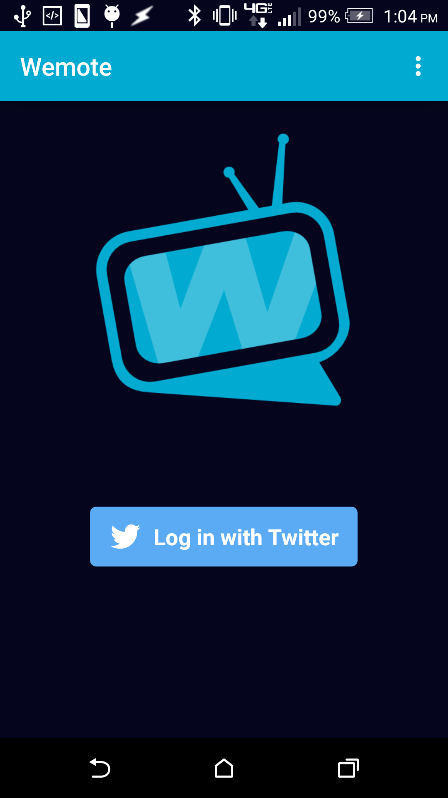
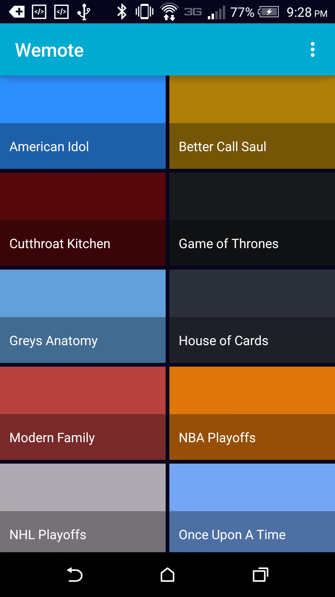
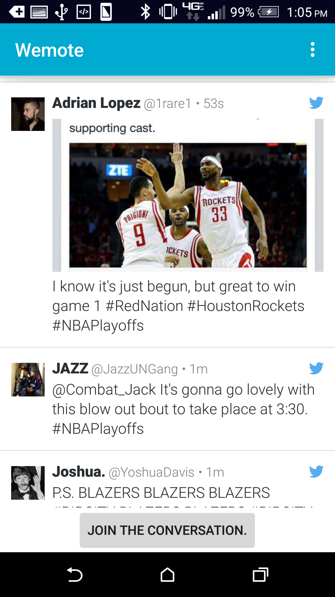

# Wemote

App for fans to chat about TV shows.

Created for Wemote team for [Startup Games](http://www.iowajpec.org/event/the-startup-games/) 2015 spring.

### Features

Login to Twitter, select a TV show you want to chat about, then join the conversation with others.

The app takes advantage of Twitter's hashtag system to build the MVP. Wemote is designed to
get TV fans chatting together about TV shows so to test this hypothesis out, the app hooks up
 analytics to view user's behavior.

> Login

> Select a show to chat about.

> Chat with others about that TV show.

### Build your own Wemote app

Build app via Android Studio IDE using the Gradle build system.

Must do following to get to work:  
1. Create [fabric.io](https://fabric.io) account.  
2. Create [Mixpanel.com](https://mixpanel.com) account.  

Now after doing that, time to implement the tokens into the app.  
1. Create a directory: `app/src/main/assets`  
2. Create a file inside this assets directory `twitter-creds.txt` and insert your Fabric.io App ID on the first line and the App Secret on the second line of the file  
3. Create a file inside this assets directory `mixpanel-creds.txt` and insert your Mixpanel.com App token on the first line of the file.  

### Why?

I was a coach for Startup Games 2015. When I was listening to the ideas, I thought this was a pretty cool idea and wanted to help out.
Turns out, the team wanted an MVP created and I felt I could get it done so I jumped on the team and got to work.
